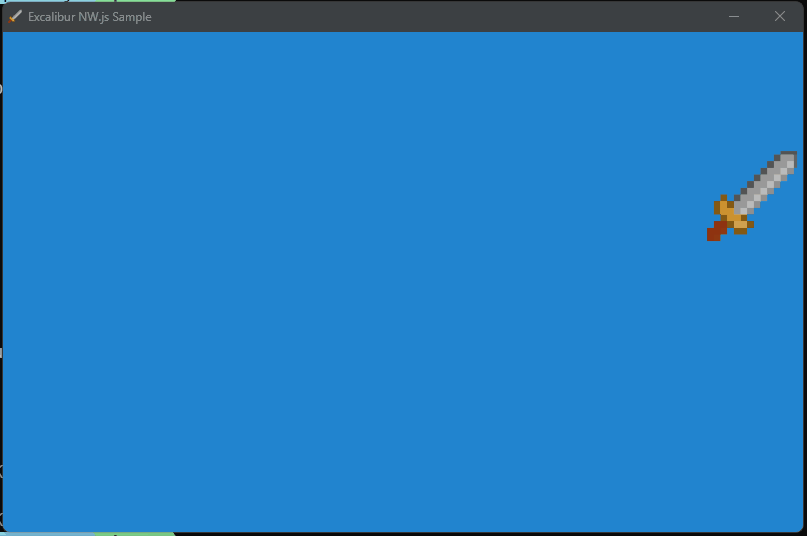

# Node Webkit Sample

This project is an example of how to use NW.js to package your excalibur game.

At the top level run

* `npm install`
* `npm build`

This will produce a new `dist/game.exe`

## Local development

* Navigate to the `src/` directory and run
* `npm install`
* `npm start` to start a local parcel server